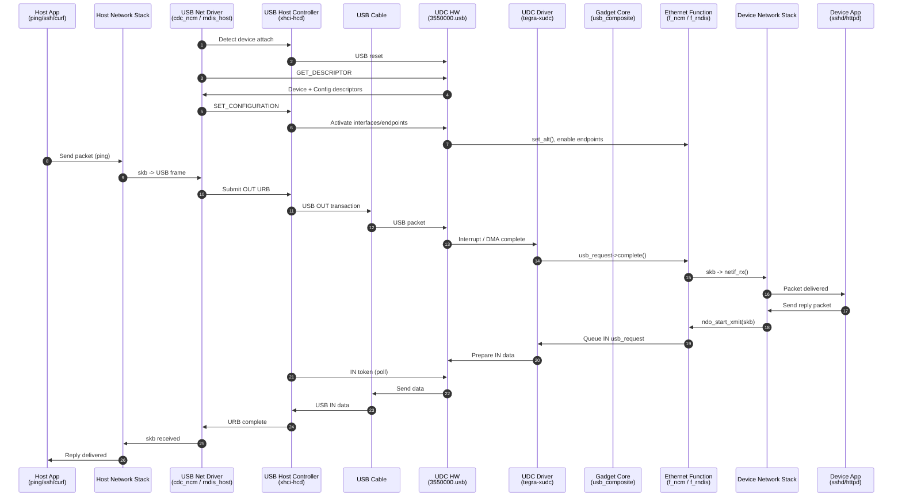

The USB controller found in most of our PCs can only act as hosts on a USB bus. But on embedded devices, the USB controller can act as a host, as a device, or as both.

Acting like a device is called "USB gadget" by Linux. Several USB gadget drivers that are alreadly available:

- Ethernet.
- Serial.
- Mass storage.
- MIDI.
- Printer.

## Basic communication flow

1. Plug & Detect: When USB device is plugged, the USB Host Controller (UHC) sends an interrupt to kernel - USB core, alerting it of new device connection.

2. Enumration: Who are you? Linux USB core sends **Standard Control Requests** to the device to gather identity data:
  - Vendor ID.
  - Product ID.
  - Device Class/Subclass.
  - Configurations & Endpoints.

3. Device matching: Based on those info, Linux match VID, PID and CLASS to the driver. Driver `probe()` that device.

4. Load the driver, and init user interfaces: `/dev/sdb`, `/dev/ttyACMx`, etc.

5. User space start talking.

## USB info

### classes

USB class and subclass: [USB-IF](https://www.usb.org/defined-class-codes)

Basic class:

- `0x01`: Audio.
- ``

### USB structure

USB devices are structured hierarchically, comprising configurations, interfaces, and endpoints to manage data transfer.

Hierarchy: Device -> Configuration(s) -> Interface(s) -> Endpoint(s).

- A USB Configuration (Configuration Descriptor): Define power consumption (mA) and groups interfaces. One device can have multiple configurations but only one active at a time.
- USB interface: Defines a specific function of the device.

NOTE: The host always init the communication, for example: in case of networking, host polls for an endpoint to check any data IN, if any, it requests to get the data.

