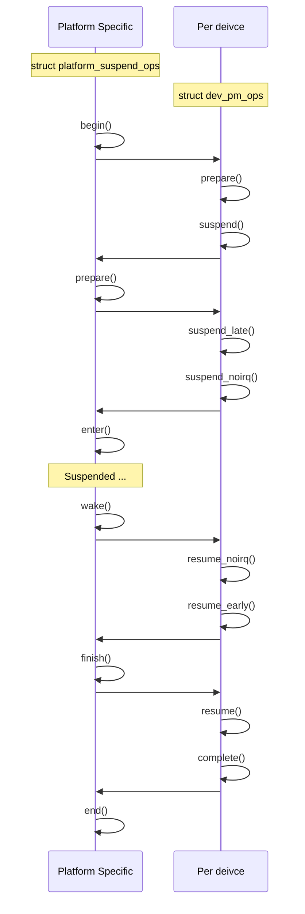

Power Management in Linux is a big subsystem that includes so many subdomains: supported hardware, CPUIdle, CPUFreq governors, DVFS, thermal, and so on. In this blog, we are going to discuss the System Wide and the Runtime Power Management frameworks, how device drivers should handle 

## 1. The key concept `struct dev_pm_ops`

The structure is a key part of device-driver and power management. That's embedded into exist `struct device_driver`, `struct bus_type`, ...

```c
struct dev_pm_ops {
    int (*prepare)(struct device *dev);
    void (*complete)(struct device *dev);
    int (*suspend)(struct device *dev);
    int (*resume)(struct device *dev);
    int (*freeze)(struct device *dev);
    // ...
    int (*runtime_suspend)(struct device *dev);
    int (*runtime_resume)(struct device *dev);
    int (*runtime_idle)(struct device *dev);
};
```

What happen when you do a system-wide suspend `echo mem > /sys/power/state`. Several hooks (platform suspend options) for platform specific will be called first and then trigger the callbacks (pm options) for every single driver in the platform.




You don't have to implement all those callbacks for your driver, some of those are handled by the core automatically. But this just allows you to hook into important points.

The `struct dev_pm_ops` will be ued for all the rest of the platform device driver level suspend.

## 1. System power management

## 2. Runtime power management

## 3. Core PM

## 3. Userspace expotion