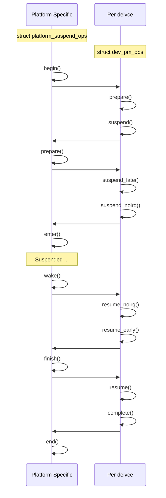

Power Management in Linux is a big subsystem that includes so many subdomains: supported hardware, CPUIdle, CPUFreq governors, DVFS, thermal, and so on. In this blog, we are going to discuss the System Wide and the Runtime Power Management frameworks, how device drivers should handle 

## 1. The key concept

### 1.1. `struct dev_pm_ops`

The structure is a key part of device-driver and power management. That's embedded into exist `struct device_driver`, `struct bus_type`, ...

```c
struct dev_pm_ops {
    int (*prepare)(struct device *dev);
    void (*complete)(struct device *dev);
    int (*suspend)(struct device *dev);
    int (*resume)(struct device *dev);
    int (*freeze)(struct device *dev);
    // ...
    int (*runtime_suspend)(struct device *dev);
    int (*runtime_resume)(struct device *dev);
    int (*runtime_idle)(struct device *dev);
};
```


What happen when you do a system suspend



## 1. System power management

## 2. Runtime power management

## 3. Core PM

## 3. Userspace expotion